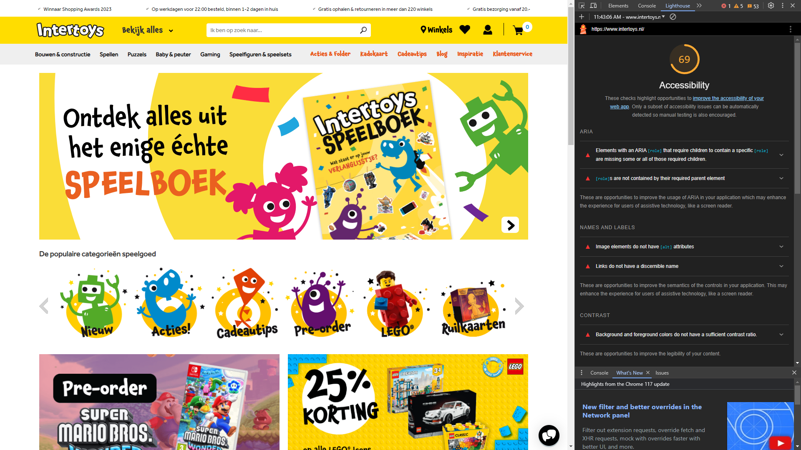
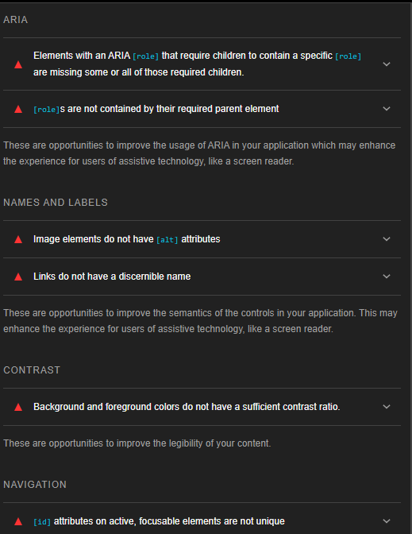
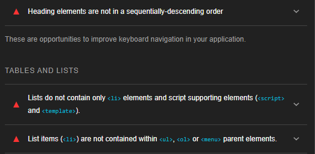

WCAG Audit

Voor het thema toegankelijk gingen we aan de slag met het vinden van slecht scorende websites. Dit deden wij door gebruik te maken van de lighthouse test. Na het bezoeken van meerdere websites heb ervoor gekozen om Intertoys te analyseren. Dat komt omdat ik meerdere websites vond met 75% score en hoger, maar Intertoys had een lagere score met 69%.

Nadat ik de lighthouse test heb gebruikt, ben ik gaan checken op de issues die tevoor zijn gekomen. De eerste issues zijn de ARIA roles die hun children roles nodig hebben. Deze zijn niet goed in code geschreven waardoor de ervaring van de klanten gehinderd wordt door het gebrek van assistive technology. Hierdoor werken functies zoals screen readers niet. 

Verder kan de semantics van de websites verbeterd worden door een alt attribute te geven aan foto's en unique link namen te geven. Hierdoor kan de ervaring voor iemand die een screen reader gebruikt beter worden. Als de namen niet gegeven worden dan kan de screen reader gebruiker niet weten waar de links en foto's over gaan. Daarnaast is de contrast ratio van de website slecht. Tekst met een low contrast tratio is vaak heel moeilijk te zien. 

Bij de navigatie aspect zijn er ook issues. De ID namen zijn niet uniek waardoor ze niet duidelijk en zichtbaar zijn voor ondersteunende technologieën. Daarnaast zijn de heading elements niet in opeenvolgend aflopende volgorde. Hierdoor is de pagina moeilijker om door te navigeren.

Ten slotte is er bij de tables and lists ook issues. Bij een lijst die geldig is moet er een parent element zijn (ul of ol elements) en child elementen (li element). Dit is bij intertoys niet het geval.

bron: https://www.intertoys.nl/